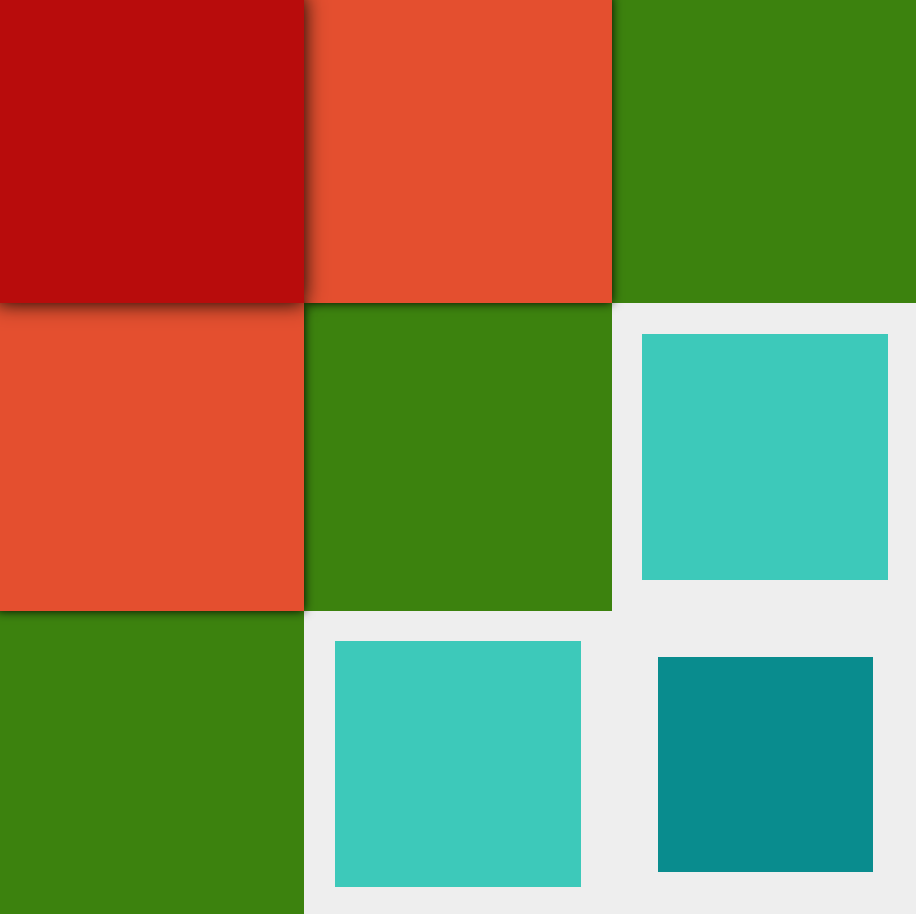
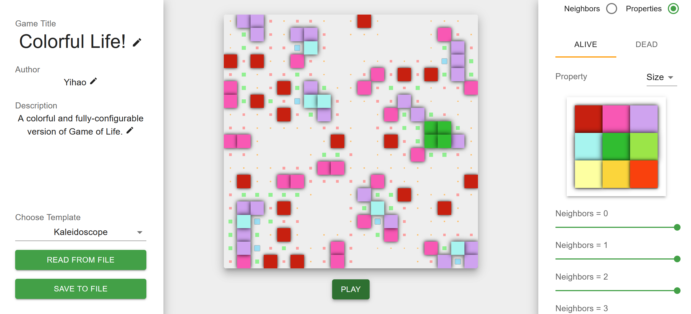
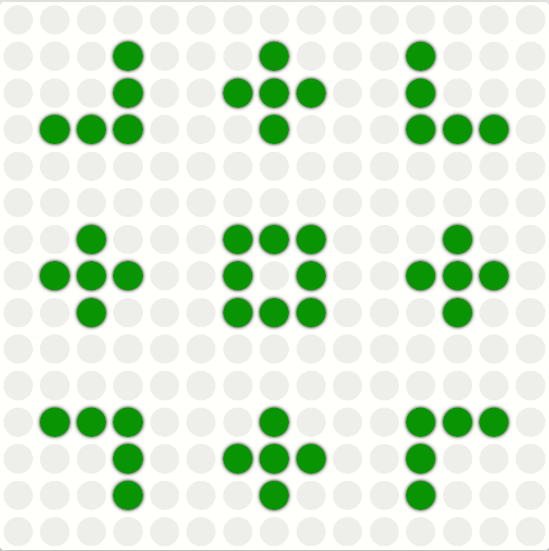
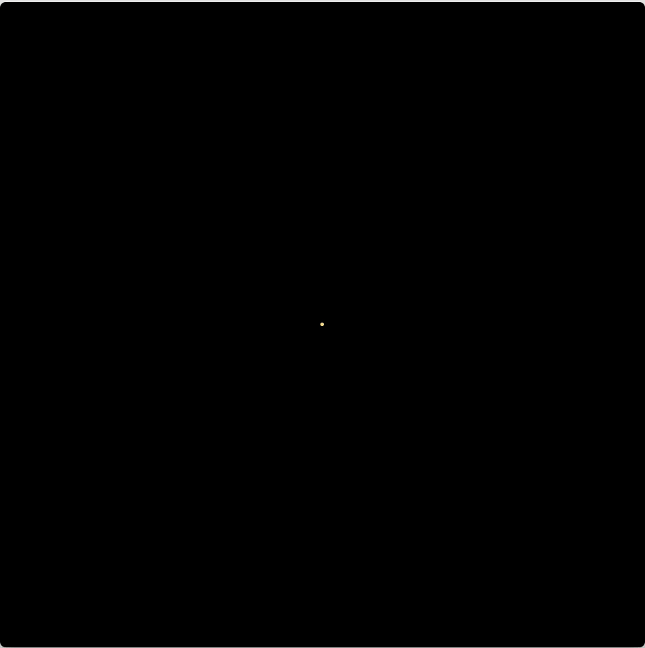
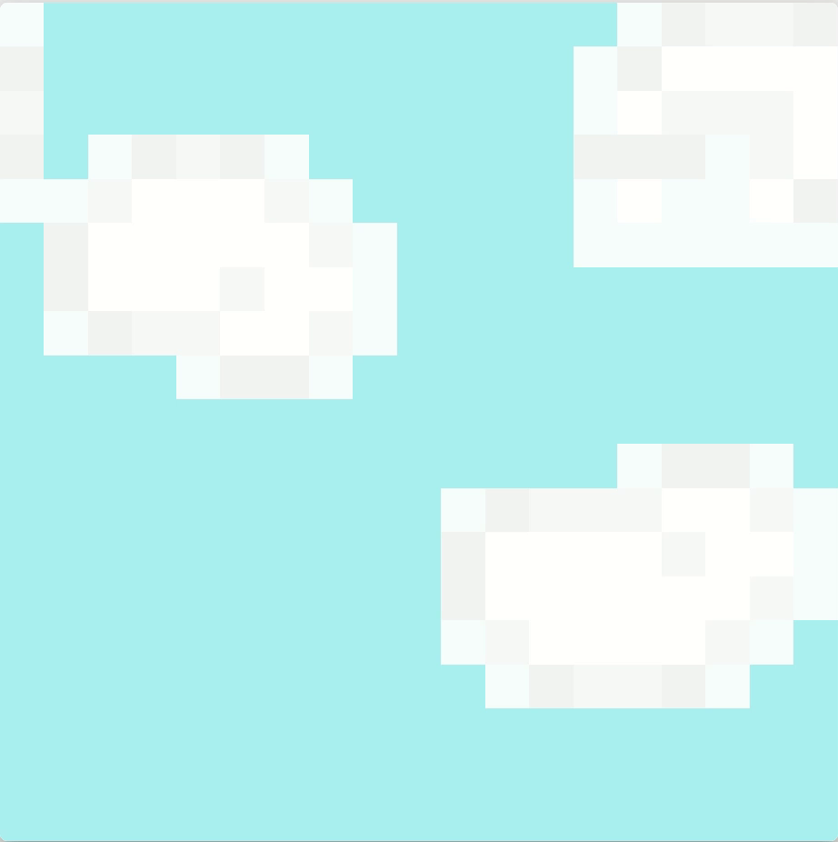
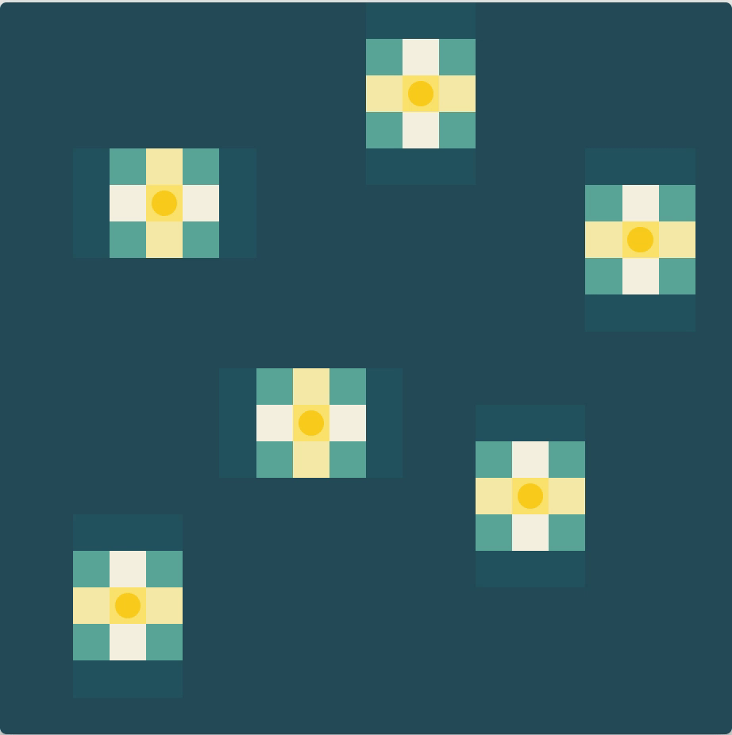
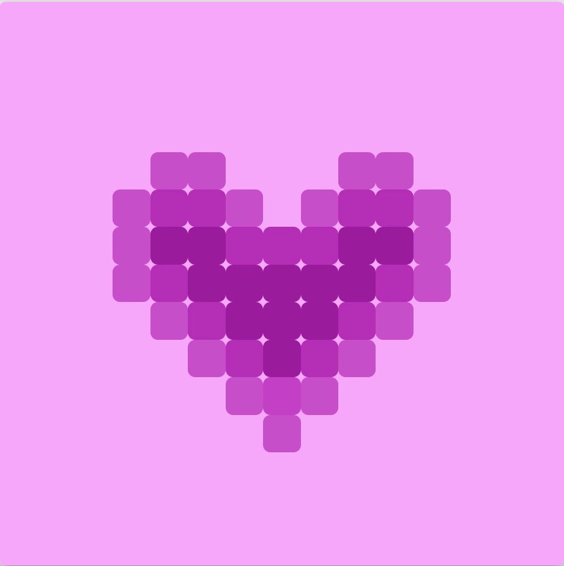

#  Colorful Life
*-- Generative art based on Conway's Game of Life*

## Introduction
[Game of life](https://en.wikipedia.org/wiki/Conway%27s_Game_of_Life) is a zero-player game developed by [John Horton Conway](https://en.wikipedia.org/wiki/John_Horton_Conway). In the original game settings, the play start the game by setting some living cells on a board. The board auto-refreshes itself in rounds. In each round, if a living cell has two or three of its neighbors being alive, it will live to the next round. Otherwise, it dies. On the other hand, if a dead cell has exactly three living neighbors, will be become alive in the next round, otherwise it stays dead.

The [Colorful Life](https://coderyihaowang.github.io/ColorfulLife/) game, as the name suggests, is a colorful version of Game of Life. All things are configurable in this game, the user can not only design the color, shape and other style properties of the cells, but also decide when the cells should convert their life status. The end result is a playground which you can use to make [generative art](https://en.wikipedia.org/wiki/Generative_art).

## How to play
1. **Starting out** \
To play the game is simple. Just open the [game site](https://coderyihaowang.github.io/ColorfulLife/). I have prepared 12 predefined templates for you. You can just choose one as the start point (from `Choose Template` on the left panel).

2. **Configure the game settings** \
All the game settings are on the right panel. You may first expand the `Game Settings` panel. You can configure all the game-level variables there. These include the size of the board, the speed of refreshing, when a living cell will become dead in the next round, and when a dead cell will revive. You can also choose how to treat the border of board (e.g. as living cells, as dead cells, or rolling over from the other side of the board).

3. **Set seeds** \
Once you have set up the game, you can now add seeds to the board. Seeds just mean living cells in the first round. To set seeds, just expand the `Seed Settings` panal, and click on `SET SEEDS`. And now you can decide which cells are alive by clicking cells on the board. Click `DONE` after you have done setting seeds. Alternatively, you could just click on `RANDOM`, and the game will generate random seeds for you. The density of the random seeds is also configurable.

4. **Style the cells**\
At this moment you can already see how the game will go by clicking on the `PLAY` button, which is under the board. But before you style your cells, it will perhaps just look like another traditional, non-exciting version of Game of Life. In fact, the main thing that distinguishes this version of Game of Life from others is that it provides players great flexibility in styling their cells. \
Cells are categorized as `living` and `dead`, and within each category, you can apply different styles to cells with different `numbers of living neighbors` (0 - 8). That is to say, you can have at most 2 * 9 = 18 completely different styles of cells at the same time on your board!\
For each style, there are 7 configurable properties: `size`, `shape`, `elevation`, `border width`, `border color`, `cell color` and `background color`. So how many possibilities are there in total? You do the math. There is no limitation to your creativity!

5. **Save your work**\
After you are satisfied with your game, you can save it. Before this, you may want to give your game a name, an author name and a description on the left panel. Then just click on `SAVE TO FILE`. This will save your game locally in the format of JSON. Later, if you want to play the game again, just click on `READ FROM FILE` to retrieve the file you have just saved.

## Examples
As mentioned earlier, this game has 12 predefined templates shipped with it (use the `Choose Template` on the left-hand-side pannel). You can use one of them as the start point. Hopefully they will give you some insights as to what you can create with the game.

||||
|-|-|-|
|Default|Garden|Fireworks|
|Clouds|Ripple|Starry Night|
|Origami|LEGO|Go|
|Heart|Kaleidoscope|Kandinsky|

**Hope you enjoy the game =)**